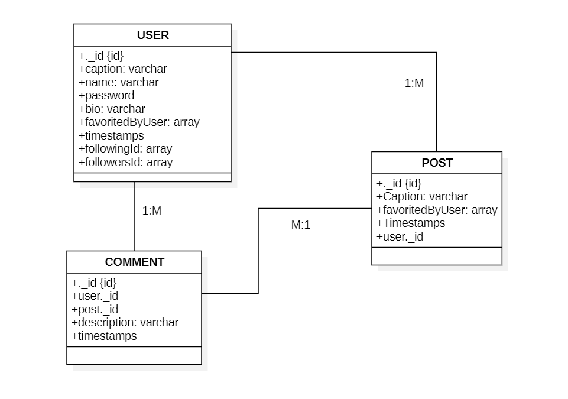

# UME: Where You and Me Connect!

#### UME is a MEN-Stack social media app designed for users to create personal profiles and connect with friends.

## 

##### _With UME, you can:_

- Create Personal Profiles
- Follow Friends
- Create Posts
- Interact with Each Other

---

### _Technology Stack:_

- **Front-end:** EJS, CSS
- **Back-end:** MongoDB, Node.js

---

### Entity Relationship Diagram

## 

### Prototype

##### You can view our app prototype on Figma: [Ume!](https://www.figma.com/design/eDMvcsURIvutKbY7duoxe0/UME?node-id=31-511&t=yuzEu3rNqDhepziH-1)

---

### _User Stories_

#### Users

- Users can search for other users
- Users can register to create new accounts
- Users can view their profile and other user's profile
- Users can edit and update their own profile, but cant edit other peoples profile
- Users can log out or delete their own account.
- Users can view a user’s following or followers list.
- Users can follow or unfollow other users.
- Users can remove a follower from their follow list.

#### Posts

- Users can view a timeline of their own Posts their following's posts.
- Users can create a new post.
- Users can edit abd update their own posts.
- Users can delete their own posts.

#### Comments

- Users can view the comments on a specific post.
- Users can add a comment to a post.
- Users can edit their own posts.
- Users can delete their own comment.

---

### _Future Enhancements_

- video uploads
- Notifications center
- Two-factor authentication
- Real-time chat

---

### _Attributions_

1. [Multer](https://www.npmjs.com/package/multer)
1. [Search Bar](https://stackoverflow.com/questions/3305561/how-to-query-mongodb-with-like)
